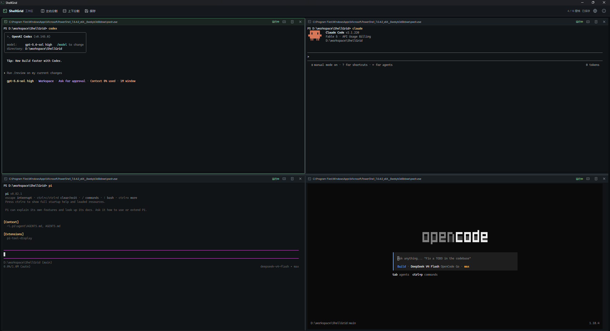

# ShellGrid

Windows x64 多终端桌面应用，每个窗格对应一个独立 PowerShell 7 进程。



## 特性

- 多窗格布局（最多 16 个），支持递归分割与比例调节
- 每个窗格独立 ConPTY 会话与 PowerShell 7 进程
- 基于 WebSocket 的安全通信，随机端口 + 启动令牌
- 窗口关闭确认与工作区自动保存
- 前端合并批处理（活动窗格 ~8ms / 后台 ~33ms）
- WebGL 渲染加速（最多 4 上下文）

## 技术栈

Tauri 2 / Rust / Svelte 5 / TypeScript / xterm.js

## 系统要求

- Windows 10 1903+
- PowerShell 7（`pwsh.exe`）
- WebView2 Runtime
- Node.js / npm
- Rust 1.77.2+（MSVC 工具链）

## 快速开始

```powershell
npm install
npm run tauri dev
```

## 开发命令

参见 [AGENTS.md](AGENTS.md)。
